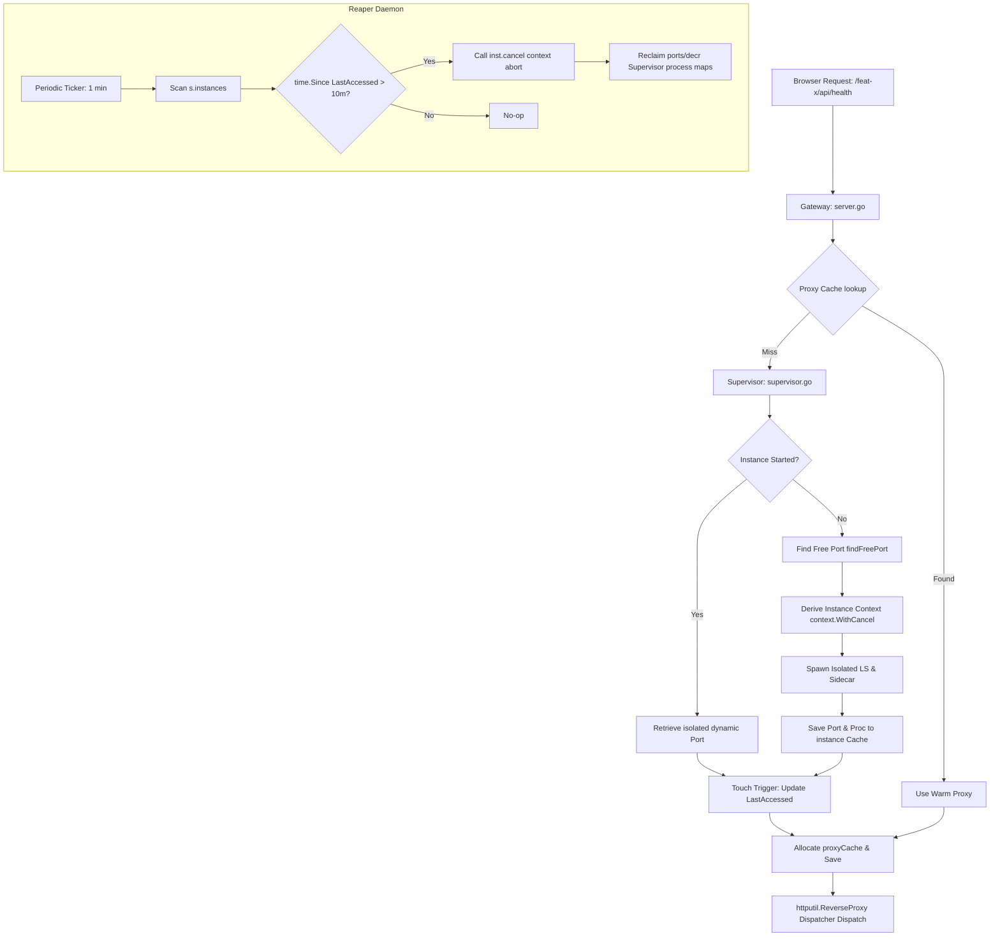

# Comprehensive Implementation Plan - Dynamic Workspace Isolation & Lifecycle Orchestration

## 1. Executive Summary

The Agent Manager v2 Gateway orchestrates isolated workspaces utilizing supervisor subprocess trees. Currently, parts of this stack rely on hardcoded ports and static setup pipelines, leading to configuration bleed hazards, resource exhaustion over time, and allocation GC bottlenecks.

This document is a **Unified Design Specification** merging previously discussed iterations into a single cohesive blueprint.

It implements:
1. **Full Dynamic Workspace Isolation**: All setups, including default `head`, route through symmetric isolated high-range random allocation discoveries safely proxied transparently.
2. **Configuration Minimalism**: Total removal of static port fields written upon standard registries disk caches.
3. **Concurrency Proxy Caches**: Prevents request-rate high allocation density pressure.
4. **Idle Instances Garbage Collection Gateway (Reaper)**: Symmetrically cleans up dynamic isolated processes maintaining safe memory and port pools usage scale safety correctly.

Critical path triggers execute end-to-end modular adjustments described below.

---

## 2. Architecture Diagram

Below describes the lifecycle of an absolute Dynamic Gateway Dispatch triggered allocating sub-pipelines:



---

## 3. Detailed Proposed Changes

The changes are grouped file by file across Go and Python workspaces.

### 3.1 [Go-Gateway Component]

#### [MODIFY] [gateway/supervisor.go](file:///topbar-frontend-switch/agent_manager/v2/gateway/supervisor.go)

**A. Domain Object Remodelling**
Introduce a sub-structure grouping dynamic state to completely eliminate flat redundant locking maps pools tracking isolation:

```go
// WorkspaceInstance maintains complete isolated lifecycle for one workspace.
type WorkspaceInstance struct {
    Name        string
    Sidecar     *managedProc
    SidecarPort int
    LS          *managedProc
    LSPort      int

    ctx          context.Context
    cancel       context.CancelFunc
    lastAccessed time.Time
}
```

Update configuration structure arrays:
```go
type Supervisor struct {
    // Binary sources for dynamic isolated allocation
    SidecarBin  string
    LSBin       string

    mu        sync.RWMutex
    cancel    context.CancelFunc
    ctx       context.Context

    // The ALL-in-one mapping:
    instances map[string]*WorkspaceInstance
}
```

**B. Refactoring Logic duplication helpers**
Refactor the redundant locking triggers residing in `GetOrStartSidecar` and `GetOrStartLanguageServer` into Unified generic allocatecycles mapping callers securely:

```go
func (s *Supervisor) getOrStartProc(
    workspaceName string,
    serviceName string,
    defaultPort int,
    getProc func(*WorkspaceInstance) *managedProc,
    setProc func(*WorkspaceInstance, *managedProc, int),
    buildCmd func(port int) []string,
) int
```

**C. Touch reset triggers**
Provide thread-safe hooks for caller propagation updates:
```go
func (s *Supervisor) TouchInstance(name string) {
    s.mu.Lock()
    defer s.mu.Unlock()
    if inst, ok := s.instances[name]; ok {
        inst.lastAccessed = time.Now()
    }
}
```

**D. Introduce Idle Instance Reaper (Garbage Collection)**
Start background routines deriving safety bounds enforcing memory cleanup triggers:
```go
func (s *Supervisor) StartReaper(ctx context.Context, idleTimeout time.Duration) {
    ticker := time.NewTicker(1 * time.Minute)
    defer ticker.Stop()
    for {
        select {
        case <-ctx.Done():
            return
        case <-ticker.C:
            s.mu.Lock()
            for name, inst := range s.instances {
                if time.Since(inst.lastAccessed) > idleTimeout {
                    log.Printf("supervisor: reaping idle isolated workspace %s", name)
                    inst.cancel()
                    delete(s.instances, name)
                }
            }
            s.mu.Unlock()
        }
    }
}
```

---

#### [MODIFY] [gateway/server.go](file:///topbar-frontend-switch/agent_manager/v2/gateway/server.go)

**A. Proxy Caching**
Create locking concurrency pool preventing GC loads hot cycles allocates triggers:

```go
type proxyCache struct {
    mu      sync.RWMutex
    proxies map[string]*workspaceProxy
}

func (pc *proxyCache) Get(ws string) *workspaceProxy
func (pc *proxyCache) Set(ws string, p *workspaceProxy)
```

**B. Cleanup static route branches triggers unification**
Route standard `head` resolving trigger dynamically constructed inside Router entrypoints wrappers safely.
Update both lookup route AND absolute `serveFromReferer` fallback guarantees symmetrically aligning dynamic propagation:

```go
        scPort := sup.GetOrStartSidecar(entry)
        lsPort := sup.GetOrStartLanguageServer(entry)

        sup.TouchInstance(entry.Name) // Keep alive trigger!

        proxy := cache.Get(entry.Name)
        if proxy == nil {
             proxy = newWorkspaceProxy(scPort, lsPort, segment)
             cache.Set(entry.Name, proxy)
        }
```

---

#### [MODIFY] [gateway/registry.go](file:///topbar-frontend-switch/agent_manager/v2/gateway/registry.go)

Prune configuration definitions structs aligned with absolute Isolation guarantees fully:

```diff
 type WorkspaceEntry struct {
     Name        string `json:"name"`
     Path        string `json:"path"`
-    SidecarPort int    `json:"sidecar_port"`
-    LSPort      int    `json:"ls_port"`
     BundlePath  string `json:"bundle_path"`
 }
```

---

#### [MODIFY] [gateway/main.go](file:///topbar-frontend-switch/agent_manager/v2/gateway/main.go)

Eliminate redundant launch flags completely deprecating allocation static buffers overheads budgets cleanly:
- Deprecate `--ls_port`
- Deprecate `--sidecar_port`

---

### 3.2 [CLI-Workspace Component]

#### [MODIFY] [cli/registry.py](file:///topbar-frontend-switch/agent_manager/v2/cli/registry.py)

Prune port specifications from workspace metadata definition schemas dataclasses symmetric support:

```diff
 @dataclasses.dataclass(frozen=True)
 class WorkspaceEntry:
   name: str
   path: str
-  sidecar_port: int
-  ls_port: int
   bundle_path: str = ""
```

Update `from_dict` filters ignoring backwards compatible legacy formats seamlessly.

---

#### [MODIFY] [agent_manager.py](file:///topbar-frontend-switch/agent_manager/v2/agent_manager.py)

**A. Prune Builder Writes triggers**
Remove redundant defaults ports allocations appended during frontend compiles initialization saves:
```diff
   entry = reg_mod.WorkspaceEntry(
       name=name,
       path=str(worktree),
-      sidecar_port=_DEFAULT_SIDECAR_PORT,
-      ls_port=_DEFAULT_LS_PORT,
       bundle_path=str(dist),
   )
```

**B. Accurate Status metrics triggers**
Modify redundant print scripts tracking outdated flat port lists to cleanly render isolation absolute capability accurately correctly.

---

## 4. Migration Guidelines - Sweeps configuration limits

Execute automated deployment migration pipeline safety strip limits sweeps existing disk setup configurations triggers safely backwards-compatible alignment guarantees:

```python
import pathlib, json

def migrate_workspaces():
    dir_path = pathlib.Path.home() / ".agent_manager" / "workspaces"
    for p in dir_path.glob("*.json"):
        data = json.loads(p.read_text())
        # Pop static metadata buffers safely
        data.pop("sidecar_port", None)
        data.pop("ls_port", None)
        p.write_text(json.dumps(data, indent=2))
        print(f"Successfully Migrated Config format: {p.name}")

if __name__ == "__main__":
    migrate_workspaces()
```

---

## 5. Verification & Testing framework

Complete end-to-end triggers validating safely:

### 5.1 Code Verification compiles safety
- Run Standard Go target triggers

- Verify Python style standards conformance:
  `./agent_manager.py test`

### 5.2 Live Instance Isolated dynamic trigger safety
1. Deploy Gateway binary launching pipeline.
2. Trigger isolated concurrency hits across parallel workspace environments routing triggers buffers.
3. Verify Supervisor allocated isolated port high-ranges correctly.
4. Verify Reaper ticks Reclaims dynamically aborted context stacks accurately transparently alleviating resource leak payloads.
