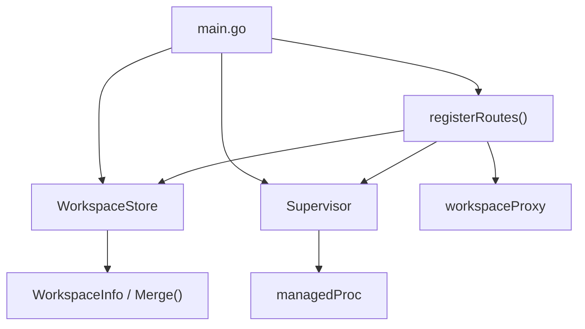

# Gateway v2 — Full Abstraction Redesign

> Companion to [gateway-v2-redesign.md](2026-03-28-gateway-v2-redesign.md),
> which covers the `WorkspaceInfo`/`WorkspaceStore` data model.
>
> This document covers how **every other gateway abstraction** changes to work
> with that new model.

---

## Abstractions at a glance

```
┌─────────────────────────────────────────────────────────────┐
│  main.go — wiring + flag parsing                            │
│                                                              │
│  Creates:                                                    │
│    WorkspaceStore  ──owns──▶  head.json + workspaces/*.json  │
│    Supervisor      ──uses──▶  WorkspaceStore (read-only)     │
│    Router          ──uses──▶  WorkspaceStore (read-only)     │
│                    ──uses──▶  Supervisor (start services)    │
│                                                              │
│  Supervisor ──creates──▶  workspaceProxy (per workspace)     │
└─────────────────────────────────────────────────────────────┘
```

**Dependency direction:** `WorkspaceStore` is the bottom of the stack. It knows
nothing about Supervisor, Router, or Proxy. Everything reads from it; nothing
writes to it except `main.go` (on startup) and the `POST /api/gateway/head`
handler.

---

## 1. `WorkspaceStore`

> Replaces: `Registry` + `HeadPointer`

Owns all workspace state: the per-workspace JSON files and the HEAD pointer.
Self-contained — no knowledge of processes, ports, or routing.

```go
type WorkspaceStore struct { /* unexported fields */ }

// Construction
func NewWorkspaceStore(dir string, headPath string, cacheTTL time.Duration) (*WorkspaceStore, error)

// --- Raw reads (from disk / cache) ---

func (s *WorkspaceStore) Get(name string) *WorkspaceEntry      // nil if not registered
func (s *WorkspaceStore) List() []*WorkspaceEntry               // all registered (raw)
func (s *WorkspaceStore) Head() *WorkspaceEntry                  // current HEAD entry (always complete), nil if unset

// --- Resolved reads (merged with HEAD fallback) ---

func (s *WorkspaceStore) Resolve(name string) (*WorkspaceInfo, error)
    // Returns workspace.Info.Merge(head.Info).
    // Errors if workspace not registered, or if HEAD is unset.

// --- Writes ---

func (s *WorkspaceStore) SetHead(name string) error
    // 1. Reads workspace entry for `name` (must exist).
    // 2. Merges: newHead = workspace.Info.Merge(oldHead.Info)
    //    → workspace paths win; missing fields keep old HEAD values.
    // 3. Writes head.json atomically.
    // 4. Errors if the resulting HEAD is incomplete (any path nil).
```

### Key invariant

**HEAD is always complete.** Every read of `Head()` returns a `WorkspaceEntry`
where all three paths are non-nil. This is enforced:

- On startup: if `head.json` does not exist, the gateway **must** be started
  with `--set-workspace-head=<name>` pointing to a workspace that has all 3
  paths. If any path is missing → fatal error.
- On `SetHead()`: the merge result must have all 3 paths. If not → error
  returned (HEAD not updated).

This eliminates nil-checking downstream. Any caller of `Resolve()` knows it
will get a fully populated `WorkspaceInfo`.

---

## 2. `Supervisor`

> Replaces: current `Supervisor` (which hard-codes blaze-bin path logic)

Owns process lifecycle: spawn, restart, reap. Does **not** own binary path
resolution — it receives fully resolved paths from callers.

```go
type Supervisor struct { /* unexported fields */ }

// Construction & lifecycle
func (s *Supervisor) Start(ctx context.Context) error
func (s *Supervisor) Stop()
func (s *Supervisor) StartReaper(ctx context.Context, idleTimeout time.Duration)

// --- Service management ---

func (s *Supervisor) GetOrStartSidecar(name string, binPath string) (port int, err error)
    // Starts (or returns existing) sidecar for workspace `name`.
    // `binPath` is the resolved sidecar binary path.

func (s *Supervisor) GetOrStartLanguageServer(name string, binPath string, bundlePath string) (port int, err error)
    // Starts (or returns existing) LS for workspace `name`.
    // `binPath` is the resolved LS binary.
    // `bundlePath` is the resolved frontend dist/ path.

func (s *Supervisor) RestartService(workspaceName, serviceName string) error

// --- Observability ---

func (s *Supervisor) TouchInstance(name string)
func (s *Supervisor) GetStatus(workspaces []*WorkspaceEntry) []WorkspaceStatus
    // Takes a list of workspaces instead of a *Registry.

// --- Proxy cache ---

func (s *Supervisor) GetProxy(name string) *workspaceProxy
func (s *Supervisor) SetProxy(name string, proxy *workspaceProxy)
```

### What changed

| Before | After |
|--------|-------|
| `Supervisor.SidecarBin` / `LSBin` fields | Deleted. No default paths stored on supervisor. |
| `UpdateDefaultsFromWorkspace()` | Deleted. Callers pass resolved paths directly. |
| `GetOrStartSidecar(workspace *WorkspaceEntry)` — discovers blaze-bin paths internally | `GetOrStartSidecar(name, binPath)` — receives resolved path. |
| `GetOrStartLanguageServer(workspace, bundlePath)` — discovers blaze-bin paths internally | `GetOrStartLanguageServer(name, binPath, bundlePath)` — receives all paths. |
| `GetStatus(reg *Registry)` — reaches into Registry | `GetStatus(workspaces)` — receives data, no dependency on store. |

The supervisor is now a **pure process manager**. It has zero knowledge of
workspace JSON files, HEAD, or binary path conventions.

---

## 3. `workspaceProxy`

> Unchanged in structure, but constructed differently.

```go
type workspaceProxy struct { /* unchanged */ }

func newWorkspaceProxy(sidecarPort, lsPort int, workspace string) *workspaceProxy
func (p *workspaceProxy) ServeHTTP(w http.ResponseWriter, r *http.Request)
```

No changes needed. The proxy is already a pure routing object (sidecar port,
LS port, workspace name). The only difference is that the **caller** that
creates it now gets ports from a supervisor that received resolved paths.

---

## 4. Router (`server.go`)

> Replaces: current `registerRoutes` with its inline process-starting logic.

The router's job: map URL → workspace → start services if needed → proxy.

```go
func registerRoutes(mux *http.ServeMux, store *WorkspaceStore, sup *Supervisor)
```

### Route table (unchanged semantics)

| Pattern | Handler |
|---------|---------|
| `GET /api/gateway/health` | Gateway health check |
| `GET /api/gateway/workspaces` | List registered workspaces |
| `GET /api/gateway/status` | Process status for all workspaces |
| `POST /api/gateway/restart` | Restart a service in a workspace |
| `GET /api/gateway/head` | Return current HEAD workspace name |
| `POST /api/gateway/head` | Set HEAD |
| `GET /<workspace>/*` | Proxy to workspace services |
| `GET /head/*` | Alias for HEAD workspace |
| `GET /` | Absolute-path leak detector |

### Key flow: resolving a workspace request

```
GET /feat-x/api/todos

1. segment = "feat-x"
2. entry = store.Get("feat-x")          → existence check (is it registered?)
3. info  = store.Resolve("feat-x")      → merged WorkspaceInfo (fills from HEAD)
4. scPort = sup.GetOrStartSidecar("feat-x", *info.SidecarPath)
5. lsPort = sup.GetOrStartLanguageServer("feat-x", *info.LSPath, *info.FrontendPath)
6. proxy  = newWorkspaceProxy(scPort, lsPort, "feat-x")
7. proxy.ServeHTTP(w, r)
```

Steps 3–6 only run on first request (proxy is cached via `sup.GetProxy`).

### `POST /api/gateway/head` handler

```
1. Validate workspace exists:     store.Get(name) != nil
2. Update HEAD:                   store.SetHead(name)
     → Merges workspace.Info with old HEAD, writes head.json.
     → Errors if result incomplete.
3. Return {"workspace": name}
```

Note: no `sup.UpdateDefaultsFromWorkspace()` call. The supervisor doesn't track
defaults anymore. Next workspace request will call `store.Resolve()` which reads
the updated HEAD.

---

## 5. `main.go` — wiring

```go
func main() {
    flag.Parse()

    store := NewWorkspaceStore(registryDir, headPath, 2*time.Second)

    // HEAD bootstrap: required on first run.
    if *setWorkspaceHead != "" {
        store.SetHead(*setWorkspaceHead)  // fatals if incomplete
    }
    if store.Head() == nil {
        log.Fatal("No HEAD workspace set. Use --set-workspace-head=<name>")
    }

    sup := &Supervisor{}
    sup.Start(ctx)
    go sup.StartReaper(ctx, 10*time.Minute)

    mux := http.NewServeMux()
    registerRoutes(mux, store, sup)

    // ... serve
}
```

### What changed

- `Registry` and `HeadPointer` are replaced by a single `WorkspaceStore`.
- `sup.UpdateDefaultsFromWorkspace(headEntry)` is deleted.
- HEAD is required — fatal if missing after flag processing.

---

## 6. `buildLSCmd` — stays in `main.go`

```go
func buildLSCmd(lsBin string, lsPort int, bundlePath string, workspaceName string) []string
```

Unchanged. It's a pure function that assembles LS flags. No dependency changes.

---

## Dependency graph (after)



**Before**, `Supervisor` depended on `Registry` (via `GetStatus`) and stored
`SidecarBin`/`LSBin` state. Now it is a leaf — it depends on nothing except
its own `managedProc` type.

---

## File mapping: old → new

| Old file | New file | Notes |
|----------|----------|-------|
| `registry.go` | `store.go` | Merged with head.go into WorkspaceStore |
| `head.go` | `store.go` | HEAD is now part of WorkspaceStore |
| `supervisor.go` | `supervisor.go` | Simplified: receives resolved paths |
| `server.go` | `server.go` | Uses WorkspaceStore instead of Registry+HeadPointer |
| `proxy.go` | `proxy.go` | Unchanged |
| `main.go` | `main.go` | Simplified wiring |
| *(new)* | `workspace.go` | `WorkspaceInfo`, `WorkspaceEntry`, `Merge()` |
| `registry_test.go` | `store_test.go` | |
| `head_test.go` | `store_test.go` | Merged |
| `main_test.go` | `main_test.go` | Unchanged |
| *(new)* | `workspace_test.go` | `Merge()` tests |

---

## Summary of what each abstraction knows

| Abstraction | Knows about | Does NOT know about |
|---|---|---|
| `WorkspaceInfo` | Three nullable paths | Files, processes, ports, routing |
| `WorkspaceEntry` | Name + WorkspaceInfo | Files, processes, ports, routing |
| `WorkspaceStore` | Dir layout, JSON files, HEAD file, merge semantics | Processes, ports, proxy, routing |
| `Supervisor` | Process lifecycle, ports, restart logic | Workspace files, HEAD, path resolution |
| `workspaceProxy` | Sidecar port, LS port, routing `/api/*` vs `/*` | Everything else |
| `Router` | URL → workspace mapping, composing store + supervisor | Binary paths (delegates to store) |
