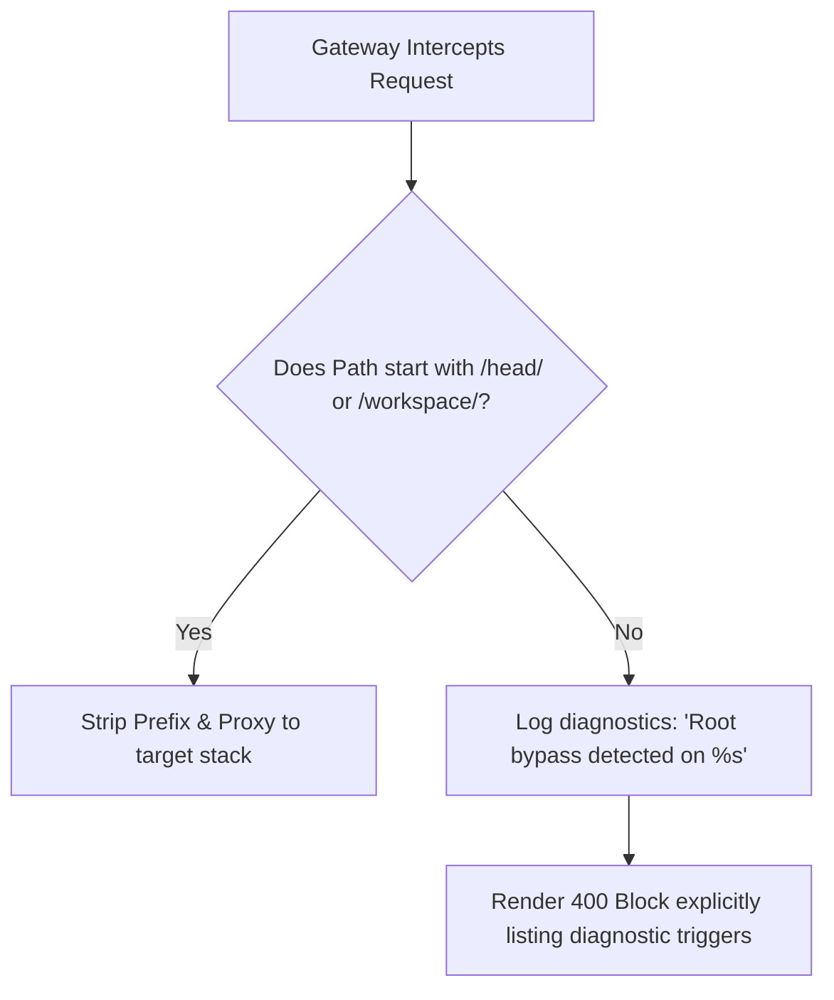

# Design: Fail-Safe Root Isolation & Diagnostics

## Goal
Establish a safety boundary on the naked root directory address space to immediately surface "Absolute Address Leaks" during front-end development cycles and troubleshoot routing bugs cleanly.

---

## 1. The Addressing Paradigm

To enforce safety nets, the Gateway strictifies directory mapping:

| Frame | Address Endpoint |
| :--- | :--- |
| **Naked Root** | `http://epot.c.googlers.com:3001/` $\rightarrow$ **BLOCKED / Logged Diagnostics** |
| **Default HEAD** | `http://epot.c.googlers.com:3001/head/` |
| **Workspace** | `http://epot.c.googlers.com:3001/<workspace-name>/` |

---

## 2. Absolute Leak Diagnostic Barrier

If a plugin uses an absolute fetch (e.g., `fetch('/api/todos')`), the browser will send the request to `http://epot:3001/api/todos`.

### The Check Logic:



---

## 3. Implementation Checks (Gateway Router)

### A. Router Firewall Middleware (`barrier.go`)
All requests hitting naked root `/` are intercepted by an aggressive audit middleware layout:

```go
func rootIsolationMiddleware(next http.Handler) http.Handler {
    return http.HandlerFunc(func(w http.ResponseWriter, r *http.Request) {
        path := r.URL.Path

        if path == "/" || (!strings.HasPrefix(path, "/head/") && !isWorkspace(path)) {
            // 1. Audit Log
            log.Printf("[DIAGNOSTICS] Root Bypass Leak Detected: %s from %s", path, r.Header.Get("Referer"))

            // 2. Render loud diagnostic blocker page
            http.Error(w, fmt.Sprintf("Absolute Path Leak Detected: Request made to naked root %s", path), http.StatusNotFound)
            return
        }

        next.ServeHTTP(w, r)
    })
}
```

### B. Main Gateway UI Access
To access the Switcher Panel/Router index:
*   Served on `http://epot.c.googlers.com:3001/gateway/` instead of root `/`.
*   Naked root strictly raises blocker triggers.

---

## 4. Benefits
1.  **Immediate bug detection**: Developers instantly see absolute path leaks fail loudly on console dashboards without silent state synchronization errors.
2.  **Troubleshoot transparency**: Diagnosing which plugin leaked absolute references becomes trivial by inspecting `log.Printf` Referer headers.
