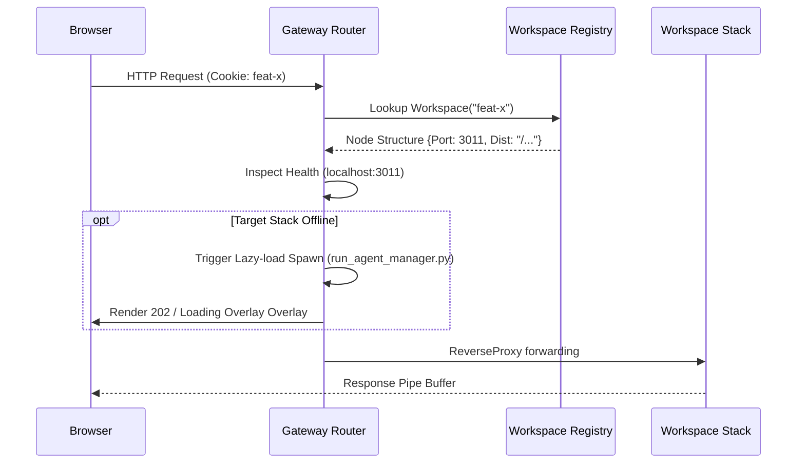

# Technical Design: Gateway Sidecar Binary

## 1. Objective
The **Gateway Sidecar** (`v1/sidecar/gateway/`) acting on the primary accessible port `3001` serves as the central routing hub. It transparently multiplexes static assets and API payloads across isolate workspace backends dynamically without requiring dedicated multi-tenant firewall port assignments.

---

## 2. Endpoint Interface Matrix

The Gateway preserves isolated internal routes while proxying the majority downstream:

| Route | Target Handler | Description |
| :--- | :--- | :--- |
| **`/api/gateway/workspaces`** | Internal `handleListWorkspaces` | Returns active JSON list node buffer to feed Switch Plugin. |
| **`/gateway/ui`** | Internal `handleServeBarrier` | Serves independent overlay buffer for loading/failover safety overlays. |
| **`/api/*`** | Dynamic Reverse Proxy | Proxied to appropriate Workspace Sidecar or defaults based on cookies. |
| **`/*`** | Dynamic Reverse Proxy | Statics/Websockets proxied to appropriate Workspace static dist/ endpoints. |

---

## 3. Struct Breakdown (Go Data Models)

### A. Registry Model
Reflects individual node records compiled in relative `.json` frame buffers.
```go
type WorkspaceNode struct {
    Name        string `json:"name"`
    Path        string `json:"path"`
    SidecarPort int    `json:"sidecar_port"`
    LSPort      int    `json:"ls_port"`
    HasEdits    bool   `json:"has_backend_edits"`
    BundlePath  string `json:"bundle_path"`
}
```

---

## 4. Reverse Proxy Engine Logic

The orchestrating handler wraps traffic headers intercept filters using standard `net/http/httputil.ReverseProxy` frames.



### Proxy Director Algorithm
```go
func buildDirector(discovery *DiscoveryManager) func(*http.Request) {
    return func(req *http.Request) {
        workspace := getWorkspaceCookie(req)
        node := discovery.GetNode(workspace)

        if node == nil || !node.HasEdits {
            // Fall back to default Head setup
            req.URL.Host = "localhost:3002"
            return
        }
        req.URL.Host = fmt.Sprintf("localhost:%d", node.SidecarPort)
    }
}
```

---

## 5. Orchestration Triggers (Start-on-Demand)

If a request targets an offline workspace:
1.  Gateway intercepts with `http.StatusAccepted` (202) serving a recovery overlay.
2.  Starts a separate goroutine invoking `exec.Command("scripts/agent_manager.py", "start", workspace_name)`.
3.  Background routine continuously triggers `net.DialTimeout` until target port resolves active.
4.  Loads visual frames securely.
