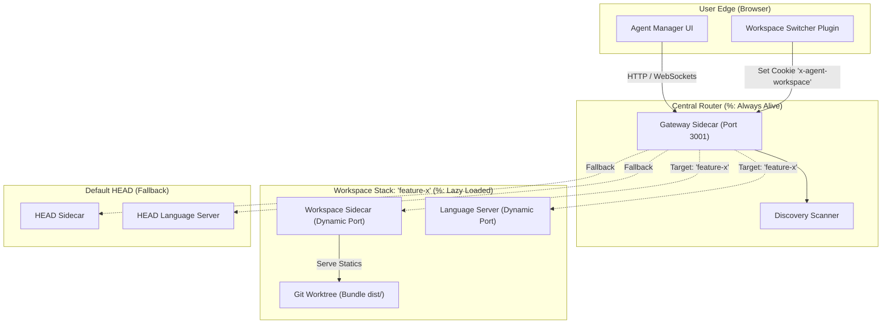
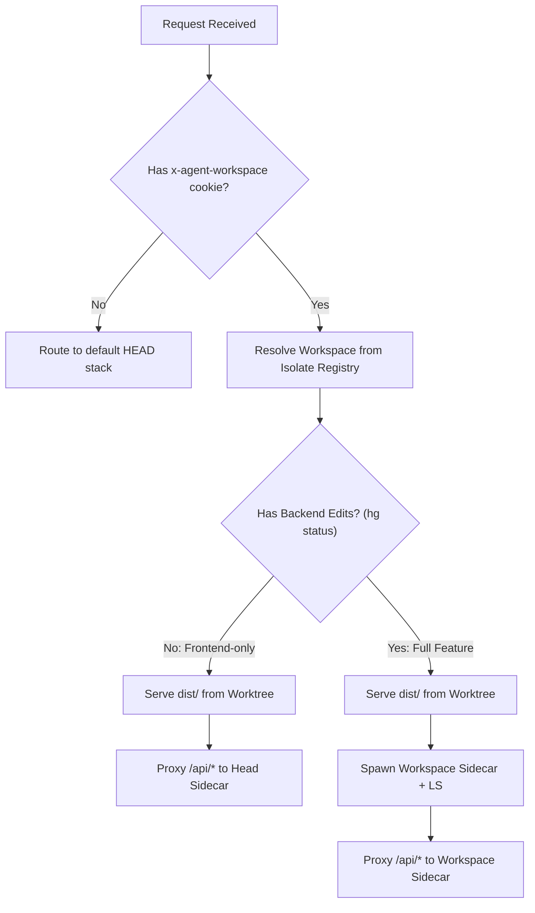

# Design v2: Workspace Gateway for Parallel Feature Testing

## Goal
Enable parallel testing of features (Frontend, Sidecar, and Language Server) developed in separate CitC workspaces through a single UI interface with seamless switching, maintaining absolute isolation while allowing accurate fallback recovery from HEAD.

---

## 1. High-Level System Anatomy

The Agent Manager stack is divided into four modular architectural pillars:

| Component | Path | Purpose |
| :--- | :--- | :--- |
| **Orchestration** | `v1/scripts/` | `run_agent_manager.py` manages process lifecycles. `rebuild.sh` manages isolated patch triggers. |
| **Gateway Sidecar** | `v1/sidecar/gateway/` | Pure infrastructure router. **Always alive** on primary port `3001`. |
| **Workspace Sidecar** | `v1/sidecar/workspace/` | Feature backend. Combines core logic with Code-Level Plugins. Runs dynamically. |
| **Logical Plugins** | `v1/plugins/` | Modular enhancements (Frontend + Backend) injected into the modular frame. |
| **Frontend Patches** | `v1/web/` | Diff records (`.patch`) applied to upstream Exafunction bundle source. |

---

## 2. Architecture Diagram

---

## 3. Data Decision Flow: Dimensional Routing

When a request hits the Gateway, it follows a contextual filter traversal to optimize loading speed:

---

## 4. Core Implementation Pillars

### A. Code-Level Plugins (Modularity)
Instead of multiplying background routers for each feature, we use code-level isolation:
*   **Location**: `v1/plugins/<name>/backend/` handlers.
*   **Mechanic**: The `workspace/main.go` aggregates and loads these modular endpoints at boot.
*   **Result**: Single active process footer with completely decoupled authoring folders.

### B. Git Worktrees (Compile Safety)
To allow N workspaces to compile statics in parallel:
*   Trigger: `rebuild.sh` creates isolate nodes: `dev-worktree/<workspace-name>`
*   Command wrapper: `git worktree add <target> HEAD --detach`
*   Output isolates continuous compiles without stepping over absolute path pointers.

### C. Lazy Loading & Failure Failovers
*   Gateway enforces a **Single Active Component** trigger checklist to preserve machine TPU/Memory overhead filters.
*   **Automatic Failover**: Proxy failures display an auxiliary standalone Error Barrier with a standalone click back to safety node overlay.

---

## 5. Design Considerations & FAQ

*   **Why do we need dynamic port mapping?**
    *   Multiple Sidecar/LS builds running consecutively cannot execute against standard `EADDRINUSE` binds.
*   **How do we block lookup race conditions?**
    *   Nodes avoid singular json lock contention, instead favoring isolate file buffers created in `~/.agent_manager/workspaces/<workspace>.json`.
*   **How seamless is the UI layer?**
    *   Cookie assignment with standalone cache reloading transitions loaded frames directly without frame drop hooks.
