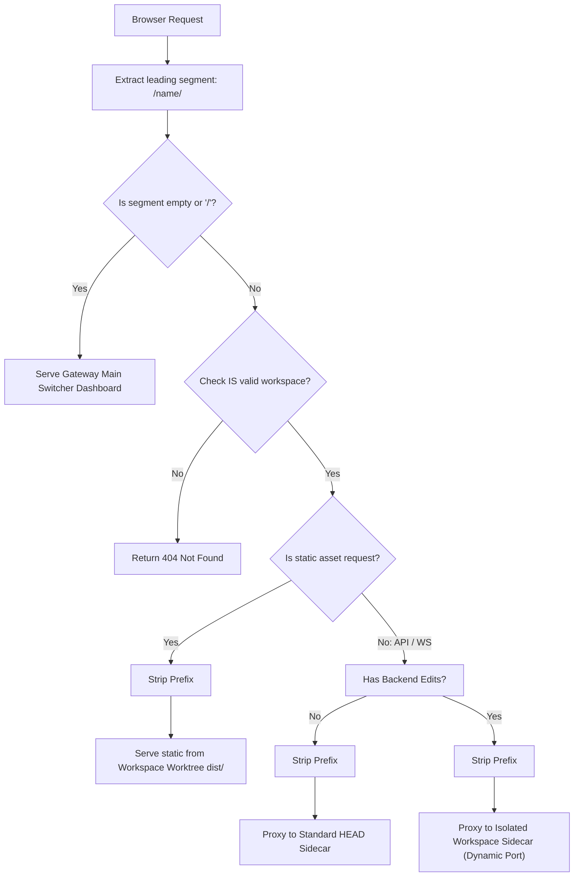

# Design v3: Path-Based Workspace Gateway

## Goal
Establish a lightweight **Workspace Gateway** router that leverages **Sub-Directory URL Routing** to enable absolute multi-tab concurrent testing of parallel Agent features (Frontend, Sidecar, and Language Server) via isolated worktrees without memory saturation.

---

## 1. High-Level Architecture

Instead of reliance on Domain Cookies (which breaks cross-tab concurrency), workspace routing is explicitly tied to browser URL segments:

| Component | Standard Address Pointer |
| :--- | :--- |
| **Main Controller UI** | `http://epot.c.googlers.com:3001/` |
| **Workspace A Panel** | `http://epot.c.googlers.com:3001/workspace-a/` |
| **Workspace B Panel** | `http://epot.c.googlers.com:3001/workspace-b/` |

---

## 2. Internal Request Routing (Director logic)

When request hits Gateway Controller Sidecar on primary port `3001`:

1.  **Segment Extraction**: Reads leading path component (e.g., `/feat-x/`).
2.  **Index Lookup**: Dynamically matches workspace isolate name from live CitC buffers.
3.  **Prefix Stripper**: The reverse proxy director updates the target Host pointer **and strips the segment from input Path**.
    *   *Input*: `/feat-x/assets/main.js` $\rightarrow$ *Downstream*: `/assets/main.js`
4.  **State Management**: Startup triggers background goroutine check for lazy starts guaranteeing offline components trigger dynamic loads with error layouts.

---

## 3. Request Mapping Framework

---

## 4. Frontend Compatibility: Relative Builds

To insulate standard setups accurately against dynamic prefixing rules:
*   **Constraint**: Upstream assets must fetch relative indices avoiding direct root pointers (`/assets/` $\rightarrow$ `assets/`).
*   **Fix**: Builder (`rebuild.sh` absorbed Python frame) updates configuration aliases injecting `base: './'` configuration triggers in `vite.config.ts`.

---

## 5. Code-Level Plugs & Isolated Worktrees

*   **Plugin Payload structure**: Plugins reside statically in `v1/plugins/` loading backend modules inside workspace boot binaries.
*   **Isolate Builds**: Orchestration creates separate detached heads `git worktree add dev-worktree/<workspace> HEAD --detach` allowing simultaneous concurrency.
*   **Orchestration limits**: Gateway enforces **Single-Active execution** reaps previous state to keep server resource metrics low.
